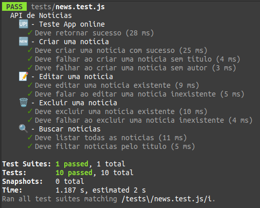
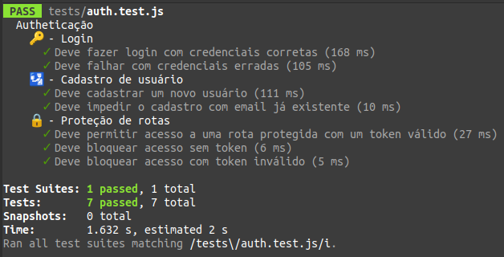

# PlathanusNews

App de cadastro de notícias. Projeto técnico para vaga Desenvolvedor Full Stack Pleno da empresa [Plathanus](https://www.plathanus.com.br/).

## Obter o código fonte do projeto

```sh
git clone git@github.com:gabrielrodriguesleite/PlathanusNews.git
```

## Testes

### Backend

```sh
cd backend
npm i
mv .env_example .env
npm test
```

O arquivo .env precisa conter um valor para JWT_SECRET

<table width="100%">
  <tr>
     <td></td>
     <td></td>
  </tr>
</table>

## Como rodar a aplicação localmente

### Inicie o backend

```sh
cd backend
npm i
mv .env_example .env
npm start
```

acesse <http://localhost:3000/app> deve mostrar o status 200 e um json `message: "app ok"`

### Inicie o frontend

```sh
cd frontend
npm i
npm start
```

acesse <http://localhost:5173/> no navegador.

## Instruções de uso

### Novo usuário

1. Na página inicial clique em "Registrar" para registrar seu usuário (autor).
2. Dessa forma o login já é realizado automaticamente e você é redirecionado para página inicial.
3. Você pode adicionar uma nova notícia com Título e conteúdo.

### Usuário cadastrado

1. Na página inicial clique em "Login" e preencha com os dados que foram registrados. (email e senha)
2. Você deve ser redirecionado para a página inicial, onde as notícias préviamente criadas aparecerão.
3. Você pode adicionar uma nova notícia com Título e conteúdo.
4. Você pode selecionar uma notícia e então removêla, ou editar dando um novo título e conteúdo.

## Backend - Node.js

## Frontend - React

## Database - Sqlite3 & Postgress

## Instruções do projeto conforme recebido

1. Desenvolvimento deverá ocorrer preferencialmente em React.
2. Após finalizar o desenvolvimento subir no github o código fonte e o Readme com as orientações.

Você deverá criar uma tela de notícias para realização de cadastro de notícias, pesquisa de notícias e visualização de notícias.
No cadastro de notícias o usuário poderá informar os seguintes dados:
· Título da notícia (obrigatório);
· Texto da notícia (ilimitado e obrigatório);
· Autor (chave estrangeira para a tabela Autor e é obrigatório).
Também devem existir a opção de editar e excluir.
Na pesquisa de notícias o usuário poderá pesquisar pelas notícias cadastradas.
Você deverá criar um layout e implementar o mesmo demonstrando as funcionalidades integrados com backend usando Node.
